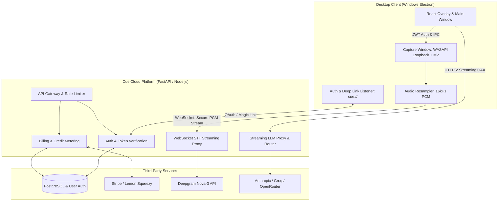
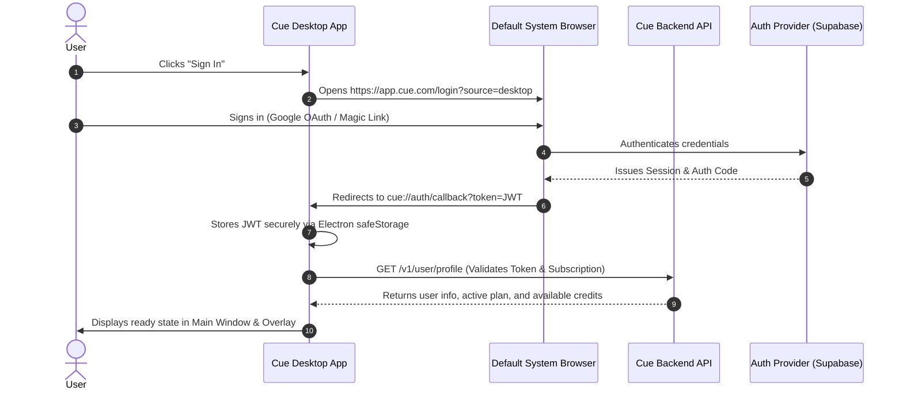
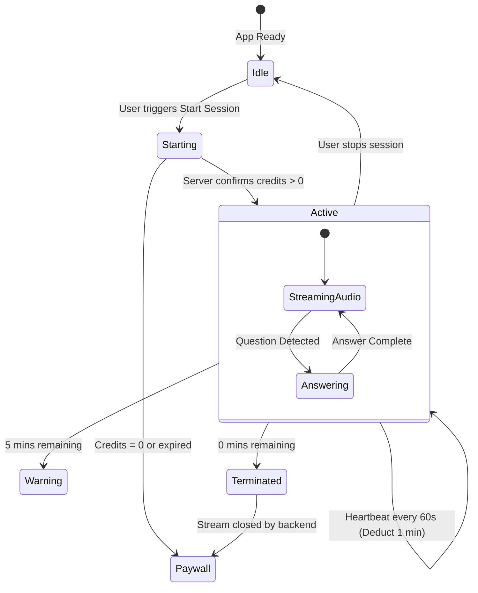
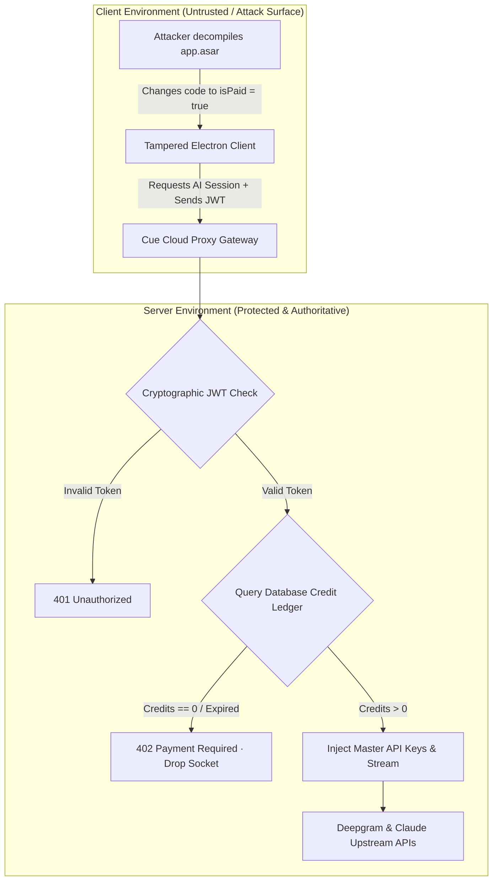
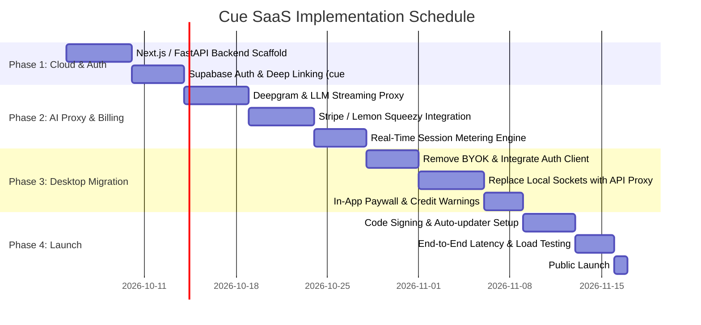

# Product Requirement Document (PRD): Cue SaaS Platform

**Document Version:** 1.1  
**Target Release:** v1.0 SaaS MVP  
**Architecture:** Hybrid Desktop Client (Electron) + Cloud AI Proxy & Billing Backend  

---

## 1. Executive Summary & Vision

### 1.1 Product Overview
Cue SaaS is an enterprise-grade and candidate-facing real-time AI copilot desktop application for live calls, interviews, and presentations. It captures system and microphone audio, transcribes live speech in sub-second latency, and delivers streaming, context-aware answers in an undetectable, always-on-top floating desktop overlay.

### 1.2 Transformation from Local to SaaS
In the original standalone version (v1.0), users provided their own API keys (Anthropic, Deepgram, Groq) and stored all data locally. This SaaS edition eliminates the technical and financial barrier of developer API keys by shifting to a managed **Subscription and Usage-Based (Pay-per-hour / Pass-based)** commercial model.

### 1.3 Key Objectives
- **Frictionless Onboarding:** Users sign up, subscribe via Stripe / Lemon Squeezy, download the desktop app, log in with one click via deep-link, and immediately start sessions.
- **API Key Security & IP Protection:** All upstream vendor keys (Deepgram, Anthropic, OpenAI, Groq) remain protected in the cloud backend.
- **Zero-Trust Client Anti-Tamper:** Client-side binary tampering (e.g. flipping `isPaid = true` in Electron `.asar`) is fundamentally powerless; transcription and answers only exist server-side.
- **Accurate Real-Time Metering:** Live session audio and generation requests are metered in seconds and tokens, stopping gracefully when balances expire.
- **High Gross Margins (>85%):** Efficient model routing (free/fast models for classification and synthesis; premium models for complex reasoning) paired with hourly pricing safeguards profitability.
- **Zero-Cost Pre-Launch Development:** The entire SaaS infrastructure runs on generous free tiers during development, incurring \$0.00 until public sales commence.

---

## 2. Business & Pricing Model

Job candidates and interviewees have high willingness to pay but short retention cycles (churning once hired). Sales and work-mode professionals require continuous monthly utility. The SaaS architecture supports both personas through a hybrid monetization strategy:

| Tier / Product | Price | Target Audience | Inclusions & Quotas |
| :--- | :--- | :--- | :--- |
| **Free Trial** | \$0 | All new signups | 15 minutes of live copilot + 1 Practice Mode interview |
| **Hourly Pack (Top-up)** | \$12 / 2 hrs | Ad-hoc or single interview | 120 minutes of live audio capture & answers (never expires) |
| **24-Hour Pass** | \$19 (one-time) | Candidate with 1–2 calls today | 4 hours live call time within a 24-hour window + unlimited practice |
| **7-Day Sprint Pass** | \$49 (one-time) | Final-round interview week | 15 hours live call time over 7 days + unlimited practice |
| **Monthly Pro** | \$69 / month | Active job seekers / Work Mode | 25 hours live call time per month + unlimited practice + priority LLM routing |

---

## 3. System Architecture



### 3.1 Architectural Components

1. **Desktop Client (Electron + React + TypeScript):**
   - Manages desktop capture, frameless transparent windows, hotkeys, and content protection (`SetWindowDisplayAffinity`).
   - Authenticates via custom protocol handler (`cue://auth/callback`).
   - Streams 16 kHz mono linear PCM chunks directly to the backend WebSocket proxy.
   - Holds zero upstream master API keys.

2. **Backend Gateway & AI Proxy (Node.js/FastAPI + Redis):**
   - Validates user JWT on every connection.
   - Verifies active subscription or credit balance before allowing session start.
   - Manages persistent WebSocket connections to Deepgram/AssemblyAI with vendor keys injected on the server.
   - Relays streaming LLM completions back to the client via Server-Sent Events (SSE).

3. **Database & Storage (PostgreSQL / Supabase):**
   - Stores users, subscription statuses, credit ledger, and usage history.
   - Transient audio streams are **never stored** on disk or in the database.

4. **Merchant of Record / Payments (Lemon Squeezy or Stripe):**
   - Handles checkout sessions, customer portal, recurring charges, and automatic global sales tax/VAT compliance.

---

## 4. User Flow & Authentication



### 4.1 Custom Protocol Registration
- On app installation, register the custom URI protocol `cue://`.
- In Windows Electron main process:
  ```typescript
  if (process.defaultApp) {
    if (process.argv.length >= 2) {
      app.setAsDefaultProtocolClient('cue', process.execPath, [path.resolve(process.argv[1])])
    }
  } else {
    app.setAsDefaultProtocolClient('cue')
  }
  ```
- Second-instance locks capture incoming deep links when the app is already open.

### 4.2 Credential Storage
- Tokens are stored locally using Electron's `safeStorage` API (which uses Windows DPAPI encryption tied to the local user account), preventing plaintext access.

---

## 5. Real-Time Metering & Session Lifecycle



### 5.1 Real-Time Billing Rules
1. **Deduction Granularity:** Live sessions are metered by the minute. Every 60 seconds of active audio stream decrements 1 minute of balance.
2. **Heartbeat Protocol:**
   - Client sends a heartbeat ping every 60 seconds: `POST /v1/session/heartbeat`.
   - Payload: `{ sessionId, activeDurationSeconds }`.
   - If heartbeat is missed for 3 minutes, the backend automatically tears down the upstream STT socket to prevent billing leakage.
3. **Graceful Exhaustion:**
   - When 5 minutes remain, the backend sends an `IPC.sessionWarning` event to the overlay: `"5 minutes of session time remaining."`
   - When 0 minutes remain, the backend terminates the STT WebSocket, streams a final notice, and prompts the client to display the **Top-Up / Upgrade** dialog.

---

## 6. Backend API & Proxy Specifications

### 6.1 Authentication & Billing Endpoints (REST)

#### `GET /v1/user/me`
- **Headers:** `Authorization: Bearer <JWT>`
- **Response:**
  ```json
  {
    "id": "usr_9918231",
    "email": "user@example.com",
    "subscription": {
      "status": "active",
      "plan": "sprint_pass",
      "validUntil": "2026-10-10T23:59:59Z"
    },
    "credits": {
      "liveSecondsRemaining": 14400,
      "practiceQuestionsRemaining": 50
    }
  }
  ```

#### `POST /v1/session/start`
- **Headers:** `Authorization: Bearer <JWT>`
- **Request:** `{ "mode": "work" | "interview" }`
- **Response:**
  ```json
  {
    "ok": true,
    "sessionId": "sess_8172312",
    "sttStreamUrl": "wss://api.cue.com/v1/stt/stream?session=sess_8172312",
    "maxDurationSeconds": 14400
  }
  ```

#### `POST /v1/billing/checkout`
- **Request:** `{ "priceId": "price_sprint_7day", "successUrl": "cue://billing/success" }`
- **Response:** `{ "url": "https://checkout.stripe.com/c/pay/cs_..." }`

---

### 6.2 Streaming STT Proxy (WebSocket)
- **URL:** `wss://api.cue.com/v1/stt/stream?session=<sessionId>`
- **Headers:** `Authorization: Bearer <JWT>`
- **Functionality:**
  - Client sends raw binary 16 kHz Linear16 PCM chunks.
  - Server proxies bytes directly to `wss://api.deepgram.com/v1/listen` with the server's master API key.
  - Server transforms Deepgram JSON messages into lightweight Cue Transcript frames and sends them back to the client:
    ```json
    { "text": "What are your greatest weaknesses?", "isFinal": true, "ts": 1790981231 }
    ```

---

### 6.3 Streaming Answer Proxy (SSE / HTTP Streaming)
- **URL:** `POST /v1/ai/generate`
- **Headers:** `Authorization: Bearer <JWT>`
- **Request Payload:**
  ```json
  {
    "sessionId": "sess_8172312",
    "mode": "interview",
    "question": "Tell me about a time you handled a difficult stakeholder.",
    "context": {
      "resumeSummary": "...",
      "notes": "..."
    },
    "style": "bullet"
  }
  ```
- **Response (Server-Sent Events):**
  ```text
  data: {"delta": "• Situ"}
  data: {"delta": "ation: In my"}
  data: {"delta": " previous role at..."}
  data: {"done": true, "tokensUsed": 184}
  ```

---

## 7. Desktop Client UI/UX Changes

### 7.1 New User States & Windows
1. **Login & Welcome Screen:**
   - Replaces the raw API Key inputs in Settings.
   - Clean prompt: *"Sign in to Cue to start answering interviews & work calls"*.
   - One-click Google Sign-In and Email Magic Link button.
2. **Subscription & Credit Status Widget:**
   - Displayed in the Main Window navigation footer:
     - Badge: `Sprint Pass · 4h 12m remaining`
     - Action button: `[Top Up / Upgrade]`
3. **Paywall Modal:**
   - Pops up when starting a session with zero credits or an expired pass.
   - Shows quick checkout links that launch Stripe/Lemon Squeezy directly in the user's browser.
4. **Stealth & Protection Maintained:**
   - All existing screen-share avoidance features (`setContentProtection(true)`, frameless floating UI, `skipTaskbar: true`, trayless stealth mode) are preserved completely in the commercial build.

---

## 8. Security, Privacy & Anti-Tamper Defense



### 8.1 Zero-Trust Client ("Dumb Terminal") Architecture
In an Electron application, local client-side verification (e.g. `if (user.isPaid)`) can easily be modified by unpacking the `.asar` archive. Cue's architecture uses a **Zero-Trust Client model**:
1. **Zero Client-Side Keys:** The desktop binary contains **zero** upstream AI provider keys or secrets.
2. **Zero Client Intelligence:** The desktop app cannot transcribe audio or generate an answer on its own.
3. **Server-Enforced Access Gate:** Even if an attacker patches the desktop JavaScript to always display an unlocked UI, the server checks the database ledger on every WebSocket connection:
   ```sql
   SELECT live_seconds_remaining FROM user_credits WHERE user_id = auth.uid();
   ```
   If the balance is 0 or expired, the server **immediately drops the WebSocket (code 4002 / Payment Required)**. The modified app receives no speech-to-text and no answers.

### 8.2 Cryptographic Session Tokens
- Auth tokens are cryptographically signed asymmetric JWTs (RS256 / Ed25519) issued by the auth provider.
- Short lifespan: **1 hour**. Client refreshes tokens via secure HTTP-only cookies or encrypted refresh tokens stored in Windows DPAPI (`safeStorage`).
- Revocation: Terminating a subscription or banning an account invalidates refresh tokens instantly.

### 8.3 Concurrency & Account-Sharing Prevention
- A user cannot purchase a \$19 pass and share credentials with multiple candidates.
- When `POST /v1/session/start` is called, the server writes an active session lock to Redis:
  ```text
  SET active_session:<user_id> <session_id> EX 18000
  ```
- If a second device attempts to initiate audio streaming under the same account, the connection is rejected:
  `"Active session underway on another device. Concurrency limit reached."`

### 8.4 Privacy & Compliance
1. **Zero Audio Retention Policy:**
   - Audio is buffered in RAM purely to forward over TLS WebSocket to the STT provider. Audio is **never written to disk, log files, or S3 buckets**.
2. **Provider Data Protection Agreements:**
   - Commercial tier terms with Deepgram and Anthropic/OpenAI ensure **zero training on customer prompts or audio**.

---

## 9. Deployment, Distribution & Code Signing

### 9.1 Windows Code Signing
- **Requirement:** Microsoft SmartScreen flags unsigned `.exe` installers with warning dialogues.
- **Solution:** Sign binaries using an Azure Trusted Signing or Sectigo Standard Code Signing Certificate during CI/CD.

### 9.2 Auto-Updates
- Implement `electron-updater` configured to an S3/Cloudflare R2 bucket:
  ```json
  "publish": {
    "provider": "generic",
    "url": "https://releases.cue.com/win32/"
  }
  ```
- When hotfixes, provider failovers, or prompt optimizations are pushed, the app updates automatically in the background.

---

## 10. Development & Operating Cost Structure ($0 Pre-Launch Strategy)

### 10.1 The $0 Pre-Launch Development Stack
The entire SaaS platform can be developed, tested, and staged at **\$0.00 cost** by utilizing developer free tiers:

| Component | Provider | Developer Free-Tier Allowance | Pre-Launch Cost |
| :--- | :--- | :--- | :--- |
| **Authentication & Database** | **Supabase** | • 50,000 Monthly Active Users<br>• 500 MB PostgreSQL database<br>• Full Google OAuth & Magic Links | **\$0.00** |
| **Payments & Invoicing** | **Stripe / Lemon Squeezy** | • Full Sandbox / Test Mode<br>• Unlimited simulated charges & webhook test triggers | **\$0.00** |
| **Web Dashboard & Landing** | **Vercel** | • Unlimited deployments<br>• Free SSL certificate & `.vercel.app` subdomain | **\$0.00** |
| **Backend API / AI Proxy** | **Localhost** *(Dev)*<br>or **Render / Fly.io** | • Run locally on PC during building (`localhost:8000`)<br>• Free cloud tier for staging tests | **\$0.00** |
| **Speech-to-Text (STT)** | **Deepgram** | • **\$200 free credit** on registration (~750 hours of audio transcription) | **\$0.00** |
| **LLM Inference** | **Groq & Google AI Studio** | • Groq: Generous free daily quota (Llama 3.3 / Qwen)<br>• Gemini 2.0 Flash: Free tier on Google AI Studio | **\$0.00** |
| **Desktop Client** | **Electron** | • Open source, builds locally on Windows | **\$0.00** |
| **Total Pre-Launch Cost** | | | **\$0.00** |

### 10.2 Post-Launch Costs (Incurred Only Upon Going Live)
1. **Custom Domain:** ~\$10 / year (e.g. `getcue.app` on Cloudflare Registrar).
2. **Merchant Fee (Per Transaction):**
   - Stripe: `2.9% + $0.30` per successful charge.
   - Lemon Squeezy (Merchant of Record): `5% + $0.50` per charge (handles all global VAT/sales tax).
   - *Fee is deducted directly from customer payments — never paid upfront.*
3. **Windows Code Signing Certificate (Optional at MVP launch):** ~\$150–\$250 / year. (Can be deferred until first 5–10 paying customers by providing install guidance).

### 10.3 Post-Launch Unit Economics & Margins
Because raw transcription and fast LLM inference are extremely affordable, profit margins exceed 90%:

- **Customer Purchases a 24-Hour Pass:** **+\$19.00**
- **COGS for 2 Active Hours of Live Calls (120 minutes):**
  - Deepgram Nova-3 Audio Transcription (120 mins @ \$0.0043/min): -\$0.52
  - Fast LLM Answers (15 questions via Groq / Nitro models): -\$0.06
  - Payment Processing Fee (Lemon Squeezy): -\$1.45
- **Net Profit per \$19 Sale:** **~\$16.97 (89.3% Net Margin)**

### 10.4 Repository Separation Strategy
- **Current Repository (`d:\Projects\interview-help`):** Kept as a standalone, local-first utility with Bring-Your-Own-Key support for private use and testing.
- **Commercial SaaS Repository (`d:\Projects\cue-saas`):** Dedicated commercial codebase with managed cloud authentication, AI proxy integration, in-app paywall, and automated distribution.

---

## 11. Phased Implementation Roadmap



### Milestone Checklist:
- [ ] **Milestone 1:** User can sign up on `app.cue.com`, authenticate the desktop app via `cue://`, and view their profile.
- [ ] **Milestone 2:** Desktop app captures audio and receives transcription via the backend WebSocket without local API keys.
- [ ] **Milestone 3:** Purchasing a \$19 Day Pass on Stripe instantly credits 4 hours of session time to the desktop app.
- [ ] **Milestone 4:** Session timer counts down and successfully prevents session starts once depleted.
- [ ] **Milestone 5:** Executable is code-signed, auto-updates cleanly, and runs silently without SmartScreen warnings.
