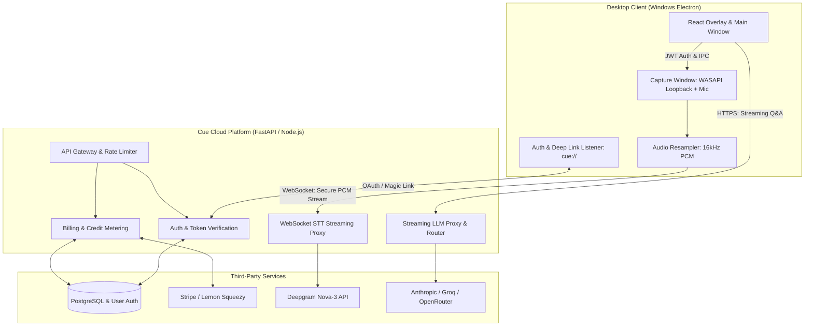
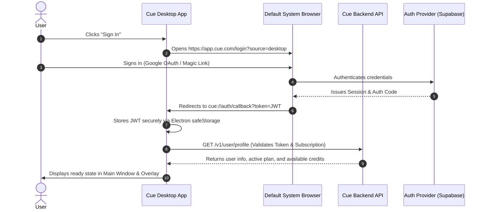
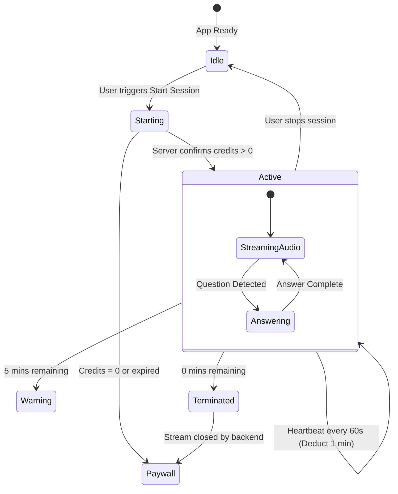
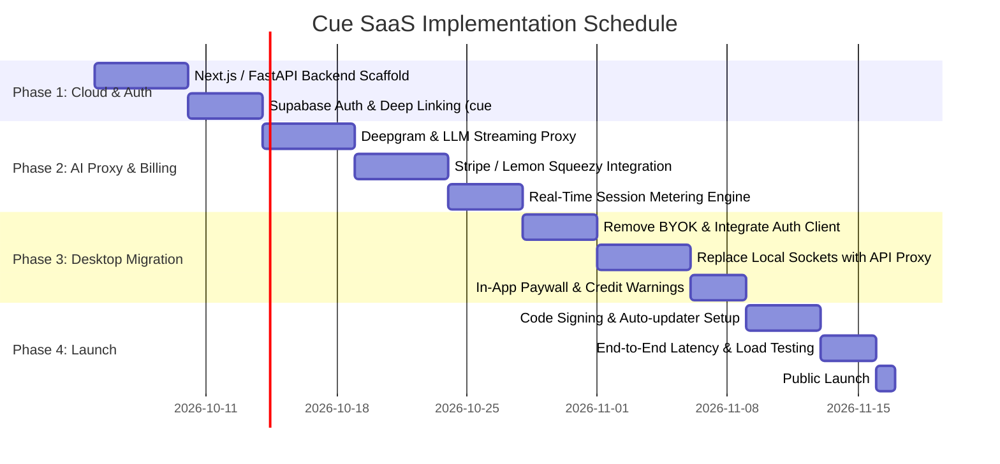

# Product Requirement Document (PRD): Cue SaaS Platform

**Document Version:** 1.0  
**Target Release:** v1.0 SaaS MVP  
**Architecture:** Hybrid Desktop Client (Electron) + Cloud AI Proxy & Billing Backend  

---

## 1. Executive Summary & Vision

### 1.1 Product Overview
Cue SaaS is an enterprise-grade and candidate-facing real-time AI copilot desktop application for live calls, interviews, and presentations. It captures system and microphone audio, transcribes live speech in sub-second latency, and delivers streaming, context-aware answers in an undetectable, always-on-top floating desktop overlay.

### 1.2 Transformation from Local to SaaS
In the original standalone version (v1.0), users provided their own API keys (Anthropic, Deepgram, Groq) and stored all data locally. This SaaS edition eliminates the technical and financial barrier of developer API keys by shifting to a managed **Subscription and Usage-Based (Pay-per-hour / Pass-based)** commercial model.

### 1.3 Key Objectives
- **Frictionless Onboarding:** Users sign up, subscribe via Stripe / Lemon Squeezy, download the desktop app, log in with one click via deep-link, and immediately start sessions.
- **API Key Security & IP Protection:** All upstream vendor keys (Deepgram, Anthropic, OpenAI, Groq) remain protected in the cloud backend.
- **Accurate Real-Time Metering:** Live session audio and generation requests are metered in seconds and tokens, stopping gracefully when balances expire.
- **High Gross Margins (>85%):** Efficient model routing (free/fast models for classification and synthesis; premium models for complex reasoning) paired with hourly pricing safeguards profitability.

---

## 2. Business & Pricing Model

Job candidates and interviewees have high willingness to pay but short retention cycles (churning once hired). Sales and work-mode professionals require continuous monthly utility. The SaaS architecture supports both personas through a hybrid monetization strategy:

| Tier / Product | Price | Target Audience | Inclusions & Quotas |
| :--- | :--- | :--- | :--- |
| **Free Trial** | \$0 | All new signups | 15 minutes of live copilot + 1 Practice Mode interview |
| **Hourly Pack (Top-up)** | \$12 / 2 hrs | Ad-hoc or single interview | 120 minutes of live audio capture & answers (never expires) |
| **24-Hour Pass** | \$19 (one-time) | Candidate with 1–2 calls today | 4 hours live call time within a 24-hour window + unlimited practice |
| **7-Day Sprint Pass** | \$49 (one-time) | Final-round interview week | 15 hours live call time over 7 days + unlimited practice |
| **Monthly Pro** | \$69 / month | Active job seekers / Work Mode | 25 hours live call time per month + unlimited practice + priority LLM routing |

---

## 3. System Architecture



### 3.1 Architectural Components

1. **Desktop Client (Electron + React + TypeScript):**
   - Manages desktop capture, frameless transparent windows, hotkeys, and content protection (`SetWindowDisplayAffinity`).
   - Authenticates via custom protocol handler (`cue://auth/callback`).
   - Streams 16 kHz mono linear PCM chunks directly to the backend WebSocket proxy.
   - Holds zero upstream master API keys.

2. **Backend Gateway & AI Proxy (Node.js/FastAPI + Redis):**
   - Validates user JWT on every connection.
   - Verifies active subscription or credit balance before allowing session start.
   - Manages persistent WebSocket connections to Deepgram/AssemblyAI with vendor keys injected on the server.
   - Relays streaming LLM completions back to the client via Server-Sent Events (SSE).

3. **Database & Storage (PostgreSQL / Supabase):**
   - Stores users, subscription statuses, credit ledger, and usage history.
   - Transient audio streams are **never stored** on disk or in the database.

4. **Merchant of Record / Payments (Lemon Squeezy or Stripe):**
   - Handles checkout sessions, customer portal, recurring charges, and automatic global sales tax/VAT compliance.

---

## 4. User Flow & Authentication



### 4.1 Custom Protocol Registration
- On app installation, register the custom URI protocol `cue://`.
- In Windows Electron main process:
  ```typescript
  if (process.defaultApp) {
    if (process.argv.length >= 2) {
      app.setAsDefaultProtocolClient('cue', process.execPath, [path.resolve(process.argv[1])])
    }
  } else {
    app.setAsDefaultProtocolClient('cue')
  }
  ```
- Second-instance locks capture incoming deep links when the app is already open.

### 4.2 Credential Storage
- Tokens are stored locally using Electron's `safeStorage` API (which uses Windows DPAPI encryption tied to the local user account), preventing plaintext access.

---

## 5. Real-Time Metering & Session Lifecycle



### 5.1 Real-Time Billing Rules
1. **Deduction Granularity:** Live sessions are metered by the minute. Every 60 seconds of active audio stream decrements 1 minute of balance.
2. **Heartbeat Protocol:**
   - Client sends a heartbeat ping every 60 seconds: `POST /v1/session/heartbeat`.
   - Payload: `{ sessionId, activeDurationSeconds }`.
   - If heartbeat is missed for 3 minutes, the backend automatically tears down the upstream STT socket to prevent billing leakage.
3. **Graceful Exhaustion:**
   - When 5 minutes remain, the backend sends an `IPC.sessionWarning` event to the overlay: `"5 minutes of session time remaining."`
   - When 0 minutes remain, the backend terminates the STT WebSocket, streams a final notice, and prompts the client to display the **Top-Up / Upgrade** dialog.

---

## 6. Backend API & Proxy Specifications

### 6.1 Authentication & Billing Endpoints (REST)

#### `GET /v1/user/me`
- **Headers:** `Authorization: Bearer <JWT>`
- **Response:**
  ```json
  {
    "id": "usr_9918231",
    "email": "user@example.com",
    "subscription": {
      "status": "active", // "active", "trial", "expired", "none"
      "plan": "sprint_pass",
      "validUntil": "2026-10-10T23:59:59Z"
    },
    "credits": {
      "liveSecondsRemaining": 14400,
      "practiceQuestionsRemaining": 50
    }
  }
  ```

#### `POST /v1/session/start`
- **Headers:** `Authorization: Bearer <JWT>`
- **Request:** `{ "mode": "work" | "interview" }`
- **Response:**
  ```json
  {
    "ok": true,
    "sessionId": "sess_8172312",
    "sttStreamUrl": "wss://api.cue.com/v1/stt/stream?session=sess_8172312",
    "maxDurationSeconds": 14400
  }
  ```

#### `POST /v1/billing/checkout`
- **Request:** `{ "priceId": "price_sprint_7day", "successUrl": "cue://billing/success" }`
- **Response:** `{ "url": "https://checkout.stripe.com/c/pay/cs_..." }`

---

### 6.2 Streaming STT Proxy (WebSocket)
- **URL:** `wss://api.cue.com/v1/stt/stream?session=<sessionId>`
- **Headers:** `Authorization: Bearer <JWT>`
- **Functionality:**
  - Client sends raw binary 16 kHz Linear16 PCM chunks.
  - Server proxies bytes directly to `wss://api.deepgram.com/v1/listen` with the server's master API key.
  - Server transforms Deepgram JSON messages into lightweight Cue Transcript frames and sends them back to the client:
    ```json
    { "text": "What are your greatest weaknesses?", "isFinal": true, "ts": 1790981231 }
    ```

---

### 6.3 Streaming Answer Proxy (SSE / HTTP Streaming)
- **URL:** `POST /v1/ai/generate`
- **Headers:** `Authorization: Bearer <JWT>`
- **Request Payload:**
  ```json
  {
    "sessionId": "sess_8172312",
    "mode": "interview",
    "question": "Tell me about a time you handled a difficult stakeholder.",
    "context": {
      "resumeSummary": "...",
      "notes": "..."
    },
    "style": "bullet"
  }
  ```
- **Response (Server-Sent Events):**
  ```text
  data: {"delta": "• Situ"}
  data: {"delta": "ation: In my"}
  data: {"delta": " previous role at..."}
  data: {"done": true, "tokensUsed": 184}
  ```

---

## 7. Desktop Client UI/UX Changes

### 7.1 New User States & Windows
1. **Login & Welcome Screen:**
   - Replaces the raw API Key inputs in Settings.
   - Clean prompt: *"Sign in to Cue to start answering interviews & work calls"*.
   - One-click Google Sign-In and Email Magic Link button.
2. **Subscription & Credit Status Widget:**
   - Displayed in the Main Window navigation footer:
     - Badge: `Sprint Pass · 4h 12m remaining`
     - Action button: `[Top Up / Upgrade]`
3. **Paywall Modal:**
   - Pops up when starting a session with zero credits or an expired pass.
   - Shows quick checkout links that launch Stripe/Lemon Squeezy directly in the user's browser.
4. **Stealth & Protection Maintained:**
   - All existing screen-share avoidance features (`setContentProtection(true)`, frameless floating UI, `skipTaskbar: true`, trayless stealth mode) are preserved completely in the commercial build.

---

## 8. Security, Privacy & Compliance (Enterprise & Candidates)

1. **Zero Audio Retention Policy:**
   - Audio is buffered in RAM purely to forward over TLS WebSocket to the STT provider. Audio is **never recorded to disk, log files, or S3 buckets**.
2. **Provider Data Protection:**
   - Commercial agreements with Deepgram and Anthropic/OpenAI ensuring **zero data training** on customer prompts or transcriptions.
3. **Anti-Abuse & Multi-Accounting:**
   - Single-session concurrency lock: a user cannot run live sessions simultaneously on multiple PCs with the same login.
   - Strict rate-limiting on LLM generation (max 10 questions / min) to prevent automated scrapers.

---

## 9. Deployment, Distribution & Code Signing

### 9.1 Windows Code Signing
- **Requirement:** Microsoft SmartScreen flags unsigned `.exe` installers with warning dialogues.
- **Solution:** Sign binaries using an Azure Trusted Signing or Sectigo Standard Code Signing Certificate during CI/CD.

### 9.2 Auto-Updates
- Implement `electron-updater` configured to an S3/Cloudflare R2 bucket:
  ```json
  "publish": {
    "provider": "generic",
    "url": "https://releases.cue.com/win32/"
  }
  ```
- When hotfixes, provider failovers, or prompt optimizations are pushed, the app updates automatically in the background.

---

## 10. Phased Implementation Roadmap



### Milestone Checklist:
- [ ] **Milestone 1:** User can sign up on `app.cue.com`, authenticate the desktop app via `cue://`, and view their profile.
- [ ] **Milestone 2:** Desktop app captures audio and receives transcription via the backend WebSocket without local API keys.
- [ ] **Milestone 3:** Purchasing a \$19 Day Pass on Stripe instantly credits 4 hours of session time to the desktop app.
- [ ] **Milestone 4:** Session timer counts down and successfully prevents session starts once depleted.
- [ ] **Milestone 5:** Executable is code-signed, auto-updates cleanly, and runs silently without SmartScreen warnings.
